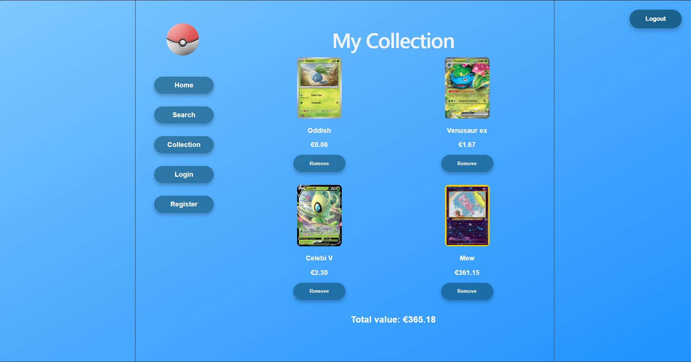

# Pokémon Card Collection Manager

## Inhoudsopgave

* [Inleiding](#inleiding)
* [Belangrijkste functionaliteiten](#belangrijkste-functionaliteiten)
* [Screenshot](#screenshot)
* [Gebruikte technieken en frameworks](#gebruikte-technieken-en-frameworks)
* [Project lokaal opzetten](#project-lokaal-opzetten)
* [Configuratie](#configuratie)
* [Inloggen](#inloggen)
* [Beschikbare npm commando’s](#beschikbare-npm-commandos)

---

## Inleiding

De Pokémon Card Collection Manager is een webapplicatie waarmee gebruikers Pokémon kaarten kunnen zoeken, bekijken en beheren in een persoonlijke digitale collectie.

Het doel van de applicatie is om verzamelaars een duidelijk overzicht te geven van hun kaarten en de actuele waarde van hun collectie.

---

## Belangrijkste functionaliteiten

* Account aanmaken en inloggen via de NOVI Dynamic API
* Pokémon kaarten zoeken op naam
* Detailinformatie per kaart bekijken
* Kaarten toevoegen aan een persoonlijke collectie
* Kaarten verwijderen uit de collectie
* Live prijsinformatie bekijken (alleen voor ingelogde gebruikers)
* Totale waarde van de collectie berekenen
* Responsive design voor desktop, tablet en mobiel

---

## Screenshot

---

## Gebruikte technieken en frameworks

Deze applicatie is ontwikkeld met de volgende technieken:

* React
* React Router DOM
* Context API
* CSS / Flexbox / Media Queries
* Axios
* Vite
* NOVI Dynamic API
* Local Storage

---

## Project lokaal opzetten

Volg onderstaande stappen om het project lokaal op te zetten.

### 1. Repository clonen

git clone https://github.com/RemcoKuipers/pokemon-app.git

---

### 2. Navigeer naar de projectmap

cd pokemon-app

---

### 3. Dependencies installeren

npm install

---

### 4. Project starten

npm run dev

Hierna draait de applicatie lokaal via:

http://localhost:5173

---

## Configuratie

Deze applicatie gebruikt de NOVI Dynamic API.

Het JSON configuratiebestand voor de NOVI API toegevoegd aan het project.

---

## Inloggen

Er kan een nieuw account worden aangemaakt via de register pagina.

Indien gewenst kan ingelogd worden met een bestaand testaccount:

Email: test@pokemonapp.nl
Wachtwoord: 123456

---

## Beschikbare npm commando’s

### Project starten

npm run dev

Start de development server.

---

### Productie build maken

npm run build

Maakt een productieversie van de applicatie.

---

### Preview build

npm run preview

Preview van de productie build lokaal.

---

### Linting

npm run lint

Controleert de code op mogelijke fouten en code style issues.

